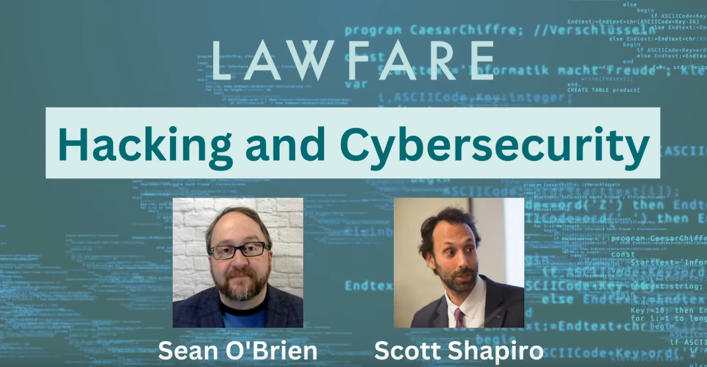

# Hacking &amp; Cybersecurity class materials

**Instructors:** [Scott J. Shapiro](https://law.yale.edu/scott-j-shapiro) &amp; [Sean O'Brien](https://cyberclear.cc)
<!-- **Guest Instructor:** [Laurin Weissinger](https://laurinw.com), Week 8: Networking III -->

## Welcome Future Hackers!

We're updating the materials for our Hacking &amp; Cybersecurity course at a [new repository](https://github.com/lawfarehacking), where we're building a friendly frontend to browse through the class. [Check out the first video!](https://www.youtube.com/watch?v=MLNlf8iNB4Y)

For the previous course materials, browse through the folders in this repository.

## What Is This Course?

To understand what this course is all about, read the press coverage and intro articles.

* [A Lawfare Hacking and Cybersecurity Course](https://www.lawfareblog.com/lawfare-hacking-and-cybersecurity-course)
* [Can You Hack It? Find Out In Our Lawfare Class](https://www.lawfareblog.com/can-you-hack-it-find-out-our-lawfare-class)
* [If Students Can Hack This Course, They’re Ready for Information Age Lawyering](https://law.yale.edu/yls-today/news/if-students-can-hack-course-theyre-ready-information-age-lawyering)
* [Knowing How to Hack Will Be Vital In a Cybercrime-filled Future](https://www.newscientist.com/article/mg25834390-100-the-cyber-lawyer-who-wants-to-teach-everyone-how-to-hack/)
* [This Is Why I Teach My Students How to Hack](https://www.nytimes.com/2023/05/23/opinion/cybersecurity-hacking.html)

## Acknowledgements &amp; Licensing

This class is based upon materials developed by [Scott J. Shapiro](https://law.yale.edu/scott-j-shapiro), [Sean O'Brien](https://cyberclear.cc), and [Laurin Weissinger](https://laurinw.com) at Yale Law School since 2018. Some of these materials have been collected at [another repository](https://github.com/seandiggity/yls-cybersec), though the design of the class has changed over time. Laurin's contributions have been [covered by tech press](https://boingboing.net/2018/11/01/pumpkin-pi-2.html) and both Scott and Sean have talked about their approach to the course in [Yale media](https://law.yale.edu/yls-today/news/if-students-can-hack-course-theyre-ready-information-age-lawyering).

These class materials are ethical Free and Open Source Software (FOSS). Any and all original work contained in this repository that is authored by Scott J. Shapiro, Sean O'Brien, and/or any guest instructors is released under the [GNU AGPL version 3](http://www.gnu.org/licenses/agpl-3.0.html) or any later version. See [LICENSE](LICENSE) for more information.

Lawfare&trade; is a trademark of the [Lawfare Institute](https://lawfareblog.com) and any and all representations of that mark in this repository are &copy; copyright Lawfare Institute.

