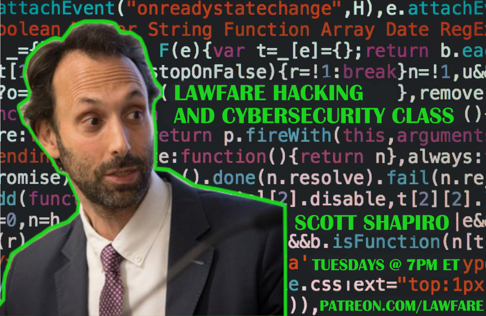
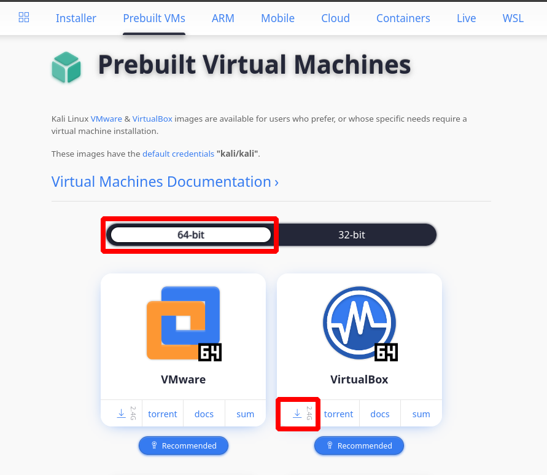

# Hacking &amp; Cybersecurity class materials
**Instructors:** [Scott J. Shapiro](mailto:scott.shapiro@yale.edu) &amp; [Sean O'Brien](mailto:sean.obrien@yale.edu)

We are delighted to announce a first on [Lawfare](https://www.lawfareblog.com/lawfare-hacking-and-cybersecurity-course): A live online class on hacking and cybersecurity.

The live-course will be open to Lawfare's [material supporters](https://www.patreon.com/lawfare), and we will edit and post each recorded class session onto YouTube as videos that will amount to a public course on computer hacking. 

Whether one joins live or watches the videos later, students will learn to use virtual machines to "hack" other virtual machines using standard attacks such as packet sniffing, buffer overflow, IP spoofing, certification forgery, Person-in-the-middle, SQL injection and Cross site scripting.

## TLDR;
Drop into the class and be ready with this Command Line Interface (CLI): 

* [OPEN COMMAND LINE INTERFACE IN BROWSER](https://bellard.org/jslinux/vm.html?url=alpine-x86.cfg&mem=192)

Though we will be using Kali Linux this CLI will get you started and following along at the start of the class. After the second week, when we move to more complex concepts and examples, this CLI will no longer be useful.

## Getting Started

To prepare for the course, students must download a) [VirtualBox](https://virtualbox.org) virtualization software that will run a "virtual machine" operating system and b) virtual machine versions of [Kali Linux](https://www.kali.org/get-kali/#kali-virtual-machines), an operating system specifically designed for hacking and penetration testing. We require students to run virtual machines to avoid problems on their own operating systems - in this way, they are running a special "operating system within an operating system" that won't mess with their Mac or Windows environment.

**NOTE:** More adventurous or experienced users may [install Kali Linux directly](https://www.kali.org/get-kali/) on their hardware without virtualization or can try virtualization software such as [VMWare](https://www.vmware.com), which may be a better option for your unique situation. However, the instructors and our support staff will not be able to help troubleshoot or guide users choosing these alternative options. As hackers say, [YMMV](https://www.howtogeek.com/693183/what-does-ymmv-mean-and-how-do-you-use-it/).

### System Requirements

To effectively run virtual machines inside your host operating system, we recommend these minimum hardware specifications: 

* 4 GB of RAM
* 32 GB of disk space
* 64 bit CPU (single core) with 2 GHz speed or better
* High definition graphics card
* Broadband Internet connection

**A good rule of thumb:** Use a computer no older than the start of the Covid pandemic, and definitely don't try this course on a computer that predates Trump's election.  We will try to accommodate students who do not have these minimum specs available, such as users with 32-bit machines.  Please contact [contact info for support staff].

### Download & Install VirtualBox

* [Video for Windows users]()
* [Video for Mac users]()
* [Video for Linux users]()

### Download & Install Kali Linux

* [Video for Windows users]()
* [Video for Mac users]()
* [Video for Linux users]()

## Syllabus

### Week 1, September 20, 2022

* Our Approach
* Introduction: Information Security
* Setting Up VirtualBox & Kali Linux
* Command Line Interface (CLI)
* The Filesystem Tree

## FAQs

[TODO Who, What, Why, Where, How answering common questions from the intro session in early September]
