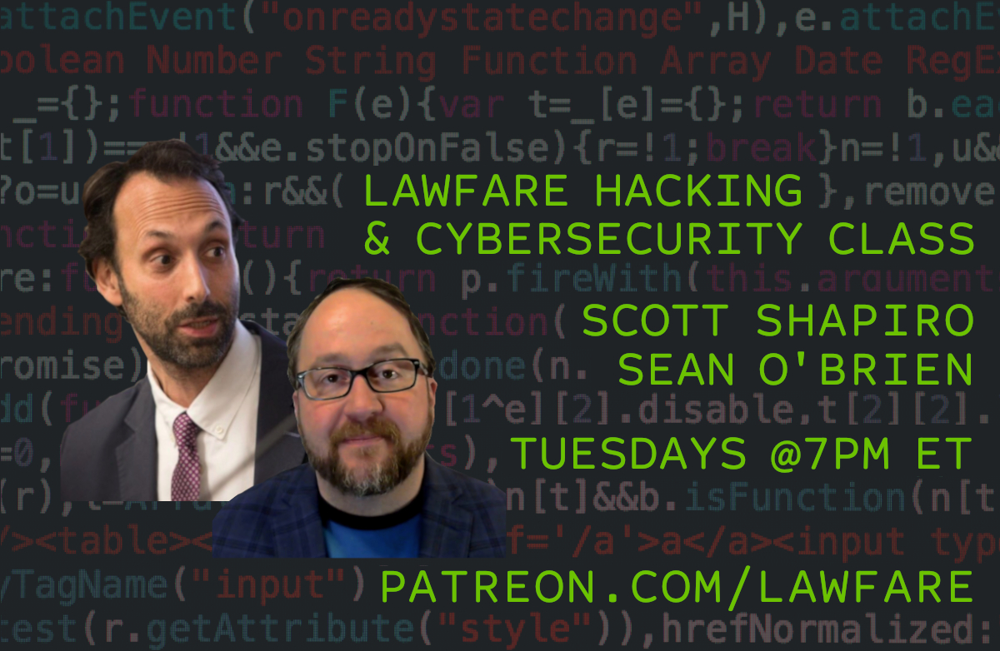
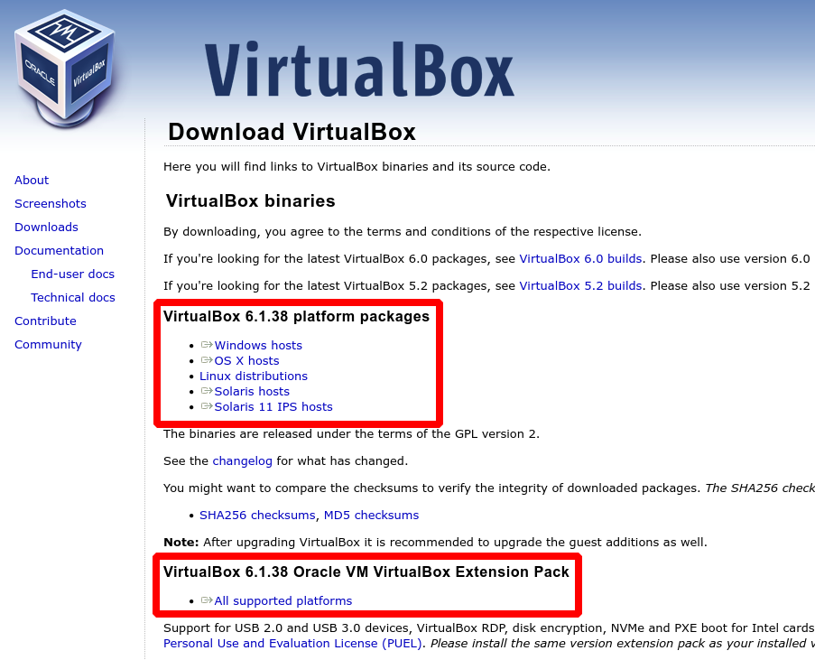

# Hacking &amp; Cybersecurity class materials

**Instructors:** [Scott J. Shapiro](mailto:scott.shapiro@yale.edu) &amp; [Sean O'Brien](mailto:sean.obrien@yale.edu)

## Welcome Future Hackers!

We are delighted to announce a first on [Lawfare](https://www.lawfareblog.com/lawfare-hacking-and-cybersecurity-course): A live online class on hacking and cybersecurity.

The live course will be open to Lawfare's [material supporters](https://www.patreon.com/lawfare), and we will edit and post each recorded class session onto YouTube as videos that will amount to a public course on computer hacking.

Whether one joins live or watches the videos later, students will learn to use virtual machines to "hack" other virtual machines using standard attacks such as packet sniffing, buffer overflow, IP spoofing, certification forgery, Adversary-in-the-Middle (AiTM or MiTM), SQL injection and Cross Site Scripting (XSS).

## TLDR;
Drop into the class and be ready with this Command Line Interface (CLI): 

* [OPEN COMMAND LINE INTERFACE IN BROWSER](https://bellard.org/jslinux/vm.html?url=alpine-x86.cfg&mem=192)

Though we will be using Kali Linux this CLI will get you started and following along at the start of the class. After the second week, when we move to more complex concepts and examples, this CLI will no longer be useful.

## Getting Started

To prepare for the course, students must download: 

1. [VirtualBox](https://www.virtualbox.org/wiki/Downloads) virtualization software that will run a "virtual machine" operating system
2. Virtual machine (VM) versions of [Kali Linux](https://www.kali.org/get-kali/#kali-virtual-machines), an operating system specifically designed for hacking and penetration testing.

We require students to run virtual machines to avoid problems on their own operating systems - in this way, they are running a special "OS within an OS" that won't mess with their Mac or Windows environment.

**NOTE:** More adventurous or experienced users may [install Kali Linux directly](https://www.kali.org/get-kali/) on their hardware without virtualization or can try virtualization software such as [VMware](https://www.VMware.com), which may be a better option for your unique situation. However, the instructors and our support staff will not be able to help troubleshoot or guide users choosing these alternative options. As hackers say, [YMMV](https://www.howtogeek.com/693183/what-does-ymmv-mean-and-how-do-you-use-it/).

### System Requirements

To effectively run virtual machines inside your host operating system, we recommend these minimum hardware specifications: 

* 4 GB of RAM
* 32 GB of disk space
* 64-bit CPU (multiple core) with 2 GHz speed or better
	- See note about the latest Mac M1/M2 models below.
* High definition graphics card
* Broadband Internet connection

**A good rule of thumb:** Use a computer no older than the start of the Covid pandemic. We will try to accommodate students who do not have these minimum specs available, such as users with 32-bit machines. See note about the latest Mac M1/M2 models below.

#### Mac M1/M2 Users

The latest Apple Mac models use a custom M1 or M2 ARM chipset that is **not 64-bit** architecture. This is a relatively new development, and virtualization on these Mac M1/M2 machines can be tricky. On these systems, the best solution seems to be [Parallels](https://www.parallels.com/blogs/parallels-desktop-apple-silicon-mac/), with [VMware Fusion](https://www.kali.org/docs/virtualization/install-VMware-silicon-host/) as an alternate option.

* [Download Parallels for Mac M1/M2 models](https://www.parallels.com/blogs/parallels-desktop-apple-silicon-mac/)
	- [Install Kali Linux on Mac M1/M2 using Parallels](https://www.kali.org/docs/virtualization/install-parallels-guest-vm/)
	- [Video 1: Install Kali on Parallels](https://www.youtube.com/watch?v=fchK2XMzou8)
	- [Video 2: Install Kali on Parallels](https://www.youtube.com/watch?v=WHlZEU5ejek)

* [Download VMware Fusion for Mac M1/M2 models](https://customerconnect.VMware.com/downloads/get-download?downloadGroup=FUS-PUBTP-22H2)
	- [Install Kali Linux on Mac M1/M2 using VMware Fusion](https://www.kali.org/docs/virtualization/install-VMware-silicon-host/)
	- [Video 1: Install Kali on VMware Fusion](https://www.youtube.com/watch?v=2qhL1Blq8es)
	- [Video 2: Install Kali on VMware Fusion](https://www.youtube.com/watch?v=RMd5PrdwiOM)

* [Video: Install Kali on Mac M1/M2 using UTM](https://www.youtube.com/watch?v=Z2e-fRLxXnU]

### Download &amp; Install VirtualBox

[Click here](https://www.virtualbox.org/wiki/Downloads) and download the VirtualBox installer for your operating system. You may also need to install the Extension Pack on your operating system, depending on settings.

VirtualBox installation tutorials: 

* [Video for Windows users](https://www.youtube.com/watch?v=8mns5yqMfZk)
* [Video for Mac users](https://www.youtube.com/watch?v=hd0Lbtly41Y)
* GNU/Linux users [Ubuntu](https://linuxize.com/post/how-to-install-virtualbox-on-ubuntu-20-04/) | [Debian](https://linuxize.com/post/how-to-install-virtualbox-on-debian-10/) | [CentOS](https://linuxize.com/post/how-to-install-virtualbox-on-centos-8/)

### Download &amp; Install Kali Linux

[CLICK HERE](https://www.kali.org/get-kali/#kali-virtual-machines) and download a 64-bit pre-built virtual machine (VM) image of Kali Linux. You will add this VM image to VirtualBox to boot into Kali Linux inside your host operating system.

Kali Linux setup tutorials: 

* [Video for Windows users](https://www.youtube.com/watch?v=bKLa8UkRYTY)
* [Video for Mac users](https://www.youtube.com/watch?v=U2nzRtDVknk)
* [Video for GNU/Linux users](https://www.youtube.com/watch?v=ILwRmXx8kwg)

## Syllabus

### Week 1: Introduction, Command Line Interface, Filesystems | Sep 20, 2022 7:00pm ET

[Scott's Video Intro](https://www.youtube.com/watch?v=cgRfNFwWYIw) | [Watch Replay](https://www.crowdcast.io/e/lawfare-hacking-and)

* Our Approach
* Introduction: Information Security
* Setting Up VirtualBox &amp; Kali Linux
* Command Line Interface (CLI)
* The Filesystem Tree

#### Week 1 Supplementary Materials (Homework)

* [The Command Line Interface (CLI) and Filesystems](https://github.com/lawfareblog/hacking-cybersecurity/blob/main/week01/Week_01_Homework.md) | [PDF](https://raw.githubusercontent.com/lawfareblog/hacking-cybersecurity/main/week01/Week_01_Homework.pdf) | [MS Word DOCX](https://raw.githubusercontent.com/lawfareblog/hacking-cybersecurity/main/week01/Week_01_Homework.docx) | [Libre ODT](https://raw.githubusercontent.com/lawfareblog/hacking-cybersecurity/main/week01/Week_01_Homework.odt) | [HTML](https://raw.githubusercontent.com/lawfareblog/hacking-cybersecurity/main/week01/Week_01_Homework.html)

**Videos:**
* Filesystems [MP4](https://raw.githubusercontent.com/lawfareblog/hacking-cybersecurity/main/week01/videos/01_Filesystems.mp4) | [WEBM](https://raw.githubusercontent.com/lawfareblog/hacking-cybersecurity/main/week01/videos/01_Filesystems.webm)
* Navigating Directories [MP4](https://raw.githubusercontent.com/lawfareblog/hacking-cybersecurity/main/week01/videos/02_Navigating_Directories.mp4) | [WEBM](https://raw.githubusercontent.com/lawfareblog/hacking-cybersecurity/main/week01/videos/02_Navigating_Directories.webm)
* Manipulating Files [MP4](https://raw.githubusercontent.com/lawfareblog/hacking-cybersecurity/main/week01/videos/03_Manipulating_Files.mp4) | [WEBM](https://raw.githubusercontent.com/lawfareblog/hacking-cybersecurity/main/week01/videos/03_Manipulating_Files.webm)

### Week 2: Get to Know Your Operating System | Sep 27, 2022 7:00pm ET

[Scott's Video Intro](https://www.youtube.com/watch?v=AhxTRUKZqPQ) | [Sign Up](https://www.crowdcast.io/e/lawfare-hacking-and-2)

* Admin / Root Access
* The Kernel
* Userspace
* Processes
* Rootkits

### Week 3: Identity &amp; Access Control | Oct 4, 2022 7:00pm ET

[Scott's Video Intro](https://www.youtube.com/watch?v=8iboJMQwOj8) | [Sign Up](https://www.crowdcast.io/e/lawfare-hacking-and-3)

* Permissions
* Creating Users &amp; Groups
* Credentials &amp; Cracking
* Principle of Least Privilege
* Privilege Escalation Attacks
* Breaking `/etc/shadow`

### Week 4: Computers &amp; Operating Systems | Oct 11, 2022 7:00pm ET

[Scott's Video Intro](https://www.youtube.com/watch?v=rWJcYZyAXUQ) | [Sign Up](https://www.crowdcast.io/e/lawfare-hacking-and-4)

* Historical &amp; Current OS's 
	- Unix
	- GNU/Linux 
	- macOS 
	- DOS
	- Windows 
	- Android 
	- iOS
* Other Computers
	- Mainframes
	- Internet of Things (IoT)
	- Industrial Control Systems 
	- Planes, Trains, &amp; Automobiles
* Adversary-in-the-Middle Attacks (AiTM or MiTM)

### Week 5: Networking I | Oct 18, 2022 7:00pm ET

[Scott's Video Intro](https://www.youtube.com/watch?v=lKsD4iuL9aI) | [Sign Up](https://www.crowdcast.io/e/lawfare-hacking-and-5)

* Networking History
* Client/Server Model
* Networking Models (OSI &amp; TCP/IP)
* Physical &amp; Internet Infrastructure
* TCP/IP &amp; UDP
* Changing Your Network Identification

### Week 6: Networking II | Oct 25, 2022 7:00pm ET

[Scott's Video Intro](https://www.youtube.com/watch?v=x-rvJpSu6xc) | [Sign Up](https://www.crowdcast.io/e/lawfare-hacking-and-6)

* Request/Response via the Web
* State
* Ports, Sockets &amp; Sessions
* Network Address Translation (NAT) &amp; Network Devices
* Virtual Private Networks (VPNs)
* Distributed Denial-of-Service (DDoS)

### Week 7: Networking II | Nov 1, 2022 7:00pm ET

[Scott's Video Intro](https://www.youtube.com/watch?v=BcUidExSTy8) | [Sign Up](https://www.crowdcast.io/e/lawfare-hacking-and-7)

* Obfuscation &amp; Hashes
* Public/Private Key Exchange
* RSA algorithm
* HTTP Encryption (SSL/TLS)
* Email Encryption (PGP/GPG)
* Certificates
* Backdoors

### Week 8: Networking III | Nov 8, 2022 7:00pm ET

[Scott's Video Intro](https://www.youtube.com/watch?v=VzHoLXniQtA) | [Sign Up](https://www.crowdcast.io/e/lawfare-hacking-and-8)

* DNS &amp; Policy
* Firewalls
* Proxies &amp; Reverse Proxies
* Network-based Intrusion Detection Systems (IDS)
* Content Delivery Networks (CDNs) &amp; Anycast

### Week 9: Penetration Testing | Nov 15, 2022 7:00pm ET

[Scott's Video Intro](https://www.youtube.com/watch?v=OGBx3MVU8eg) | [Sign Up](https://www.crowdcast.io/e/lawfare-hacking-and-9)

* Delivering Payloads
* SQL Injection Attacks
* Metasploit Framework
* Using Metasploit

### Week 10: Anonymity &amp; The Dark Web | Nov 22, 2022 7:00pm ET

[Scott's Video Intro](https://www.youtube.com/watch?v=beAQCjiBFhw) | [Sign Up](https://www.crowdcast.io/e/lawfare-hacking-and-10)

* Onion Routing (Tor)
* Censorship Circumvention
* Configuring Tor
* Sharing Files Anonymously

### Week 11: Chains of Trust | Nov 29, 2022 7:00pm ET

[Scott's Video Intro](https://www.youtube.com/watch?v=xZa1YVI2sfg) | [Sign Up](https://www.crowdcast.io/e/lawfare-hacking-and-11)

* Trusted Software Distribution
* Software Verification
* Hardware Assurance
* Free &amp; Open Source Software (FOSS)
* Open Source Hardware
 
### Week 12: Cybercrime | Dec 6, 2022 7:00pm ET

[Scott's Video Intro](https://www.youtube.com/watch?v=KgLqOFQj5EE) | [Sign Up](https://www.crowdcast.io/e/lawfare-hacking-and-12)

* Types of Cybercrimes
* Varieties of Malware
* Fraud &amp; Phishing
* Data Breaches
* Crime as a Service
* Social Engineering

### Week 13: Review of Hacks I | Dec 13, 2022 7:00pm ET

[Scott's Video Intro](https://www.youtube.com/watch?v=1VHHtJKkb2Q) | [Sign Up](https://www.crowdcast.io/e/lawfare-hacking-and-13)

### Week 14: Review of Hacks II | Dec 20, 2022 7:00pm ET

[Scott's Video Intro](https://www.youtube.com/watch?v=nBFZk4k8VHw) | [Sign Up](https://www.crowdcast.io/e/lawfare-hacking-and-14)

