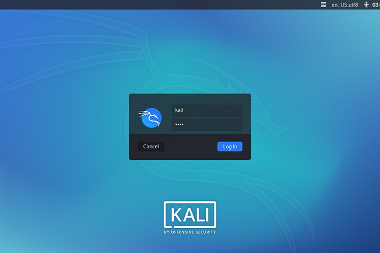

# Hacking &amp; Cybersecurity class materials

**Instructors:** [Scott J. Shapiro](https://law.yale.edu/scott-j-shapiro) &amp; [Sean O'Brien](https://cyberclear.cc)
<!-- **Guest Instructor:** [Laurin Weissinger](https://laurinw.com), Week 8: Networking III -->

## Welcome Future Hackers!

We are delighted to announce a first on [Lawfare](https://www.lawfareblog.com/lawfare-hacking-and-cybersecurity-course): A live online class on hacking and cybersecurity.

The live course will be open to Lawfare's [material supporters](https://www.patreon.com/lawfare), and we will edit and post each recorded class session as videos that will amount to a public course on computer hacking.

Whether one joins live or watches the videos later, students will learn to use virtual machines to "hack" other virtual machines using standard attacks such as packet sniffing, buffer overflow, IP spoofing, certification forgery, Adversary-in-the-Middle (AiTM or MiTM), SQL injection and Cross Site Scripting (XSS).

## TLDR;
Drop into the class and be ready with this Command Line Interface (CLI): 

* [OPEN COMMAND LINE INTERFACE IN BROWSER](https://bellard.org/jslinux/vm.html?url=alpine-x86.cfg&mem=192)

Though we will be using Kali Linux this CLI will get you started and following along at the start of the class. After the second week, when we move to more complex concepts and examples, this CLI will no longer be useful.

## Getting Started

To prepare for the course, students must download: 

1. [VirtualBox](https://www.virtualbox.org/wiki/Downloads) virtualization software that will run a "virtual machine" operating system
2. Virtual machine (VM) versions of [Kali Linux](https://www.kali.org/get-kali/#kali-virtual-machines), an operating system specifically designed for hacking and penetration testing.

We require students to run virtual machines to avoid problems on their own operating systems - in this way, they are running a special "OS within an OS" that won't mess with their Mac or Windows environment.

**NOTE:** More adventurous or experienced users may [install Kali Linux directly](https://www.kali.org/get-kali/) on their hardware without virtualization or can try virtualization software such as [VMware](https://www.VMware.com), which may be a better option for your unique situation. However, the instructors and our support staff will not be able to help troubleshoot or guide users choosing these alternative options. As hackers say, [YMMV](https://www.howtogeek.com/693183/what-does-ymmv-mean-and-how-do-you-use-it/).

### System Requirements

To effectively run virtual machines inside your host operating system, we recommend these minimum hardware specifications: 

* 4 GB of RAM
* 32 GB of disk space
* 64-bit CPU (multiple core) with 2 GHz speed or better
	- See [note about the latest Mac M1/M2 models](#Mac-M1M2-Users) below.
* High definition graphics card
* Broadband Internet connection
* Latest versions of Windows, macOS, or GNU/Linux (Ubuntu, Debian, or CentOS recommended)

**A good rule of thumb:** Use a computer no older than the start of the Covid pandemic. We will try to accommodate students who do not have these minimum specs available, such as users with 32-bit machines. See [note about the latest Mac M1/M2 models](#Mac-M1M2-Users) below.

#### Mac M1/M2 Users

The latest Apple Mac models use a custom M1 or M2 ARM chipset, known as Apple Silicon, that is **not an Intel or AMD** architecture (commonly referred to on the websites we link as "64-bit" or "x64").

This is a relatively new development, and virtualization on these Mac M1/M2 machines can be tricky. On these systems, the best solution seems to be [Parallels](https://www.parallels.com/blogs/parallels-desktop-apple-silicon-mac/), with [VMware Fusion](https://www.kali.org/docs/virtualization/install-VMware-silicon-host/) as an alternate option.

* [Download Parallels for Mac M1/M2 models](https://www.parallels.com/blogs/parallels-desktop-apple-silicon-mac/)
	- [Install Kali Linux on Mac M1/M2 using Parallels](https://www.kali.org/docs/virtualization/install-parallels-guest-vm/)
	- [Video 1: Install Kali on Parallels](https://www.youtube.com/watch?v=fchK2XMzou8)
	- [Video 2: Install Kali on Parallels](https://www.youtube.com/watch?v=WHlZEU5ejek)

* [Download VMware Fusion for Mac M1/M2 models](https://customerconnect.VMware.com/downloads/get-download?downloadGroup=FUS-PUBTP-22H2)
	- [Install Kali Linux on Mac M1/M2 using VMware Fusion](https://www.kali.org/docs/virtualization/install-vmware-silicon-host/)

	- [Video 1: Install Kali on VMware Fusion](https://www.youtube.com/watch?v=2qhL1Blq8es)
	- [Video 2: Install Kali on VMware Fusion](https://www.youtube.com/watch?v=RMd5PrdwiOM)

* [Install Kali on Mac M1/M2 using UTM](https://www.kali.org/docs/virtualization/install-utm-guest-vm/)
	- [Video: Install Kali on Mac M1/M2 using UTM](https://www.youtube.com/watch?v=Z2e-fRLxXnU)

### Download &amp; Install VirtualBox

[CLICK HERE](https://www.virtualbox.org/wiki/Downloads) and download the VirtualBox installer for your operating system. You may also need to install the Extension Pack on your operating system, depending on settings.

VirtualBox installation tutorials: 

* [Video for Windows users](https://www.youtube.com/watch?v=8mns5yqMfZk)
* [Video for Mac users](https://www.youtube.com/watch?v=hd0Lbtly41Y)
* GNU/Linux users: [Ubuntu](https://linuxize.com/post/how-to-install-virtualbox-on-ubuntu-20-04/) | [Debian](https://linuxize.com/post/how-to-install-virtualbox-on-debian-10/) | [CentOS](https://linuxize.com/post/how-to-install-virtualbox-on-centos-8/)

### Download &amp; Install Kali Linux

[CLICK HERE](https://www.kali.org/get-kali/#kali-virtual-machines) and download a 64-bit pre-built virtual machine (VM) image of Kali Linux. You will add this VM image to VirtualBox to boot into Kali Linux inside your host operating system.

Kali Linux setup tutorials: 

* [Video for Windows users](https://www.youtube.com/watch?v=bKLa8UkRYTY)
* [Video for Mac users](https://www.youtube.com/watch?v=U2nzRtDVknk)
* [Video for GNU/Linux users](https://www.youtube.com/watch?v=ILwRmXx8kwg)

#### Extracting the 7-Zip Files

[Kali Linux VMs](https://www.kali.org/get-kali/#kali-virtual-machines) are distributed in a compressed 7-Zip .7z format.  If your OS does not have software to extract 7-Zip files, please try installing one of these options: 

* [PeaZIP](https://peazip.github.io/)
* [7-Zip](https://www.7-zip.org/)
* [IZArc](https://www.izarc.org/downloads)

#### Log In to Kali Linux

You may have to [restart your system](https://www.youtube.com/watch?v=p85xwZ_OLX0) to make sure virtualization drivers are loaded by your OS. Once you can boot Kali Linux, please log in. If you have installed Kali via the [VirtualBox VM method we recommend](https://www.kali.org/get-kali/#kali-virtual-machines), the default credentials are: 

* username: `kali`
* password: `kali`

Don't worry, we'll show you how to change this default password (and crack the weak passwords of other users)!

### Metasploit &amp; Metasploitable

[Metasploit](https://docs.metasploit.com/) is a suite of exploits and penetration testing tools that is installed by default on Kali Linux. We demonstrate Metasploit via the `msfconsole` command throughout this course and it's one of the most important tools at your displosal as an ethical hacker. Real-world exploits such as [EternalBlue](https://en.wikipedia.org/wiki/EternalBlue), the exploit behind waves of ransomware, are merged into Metasploit as they become well-known and utilized in-the-wild.

[Metasploitable](https://docs.rapid7.com/metasploit/metasploitable-2/) (Metasploitable-2) is a purposefully vulnerable operating system. It is a secure place to perform penetration testing and security research, notably by attacking it with Metasploit. To follow along with our live hacks in class, this virtual machine will be required. Additionally, it provides a good basis for your final hacks (though it is not required for your final project).

### Download &amp; Install Metasploitable

[CLICK HERE](https://sourceforge.net/projects/metasploitable/) and download a 64-bit pre-built virtual machine (VM) image of Metasploitable. You will add this VM image to VirtualBox to boot into Metasploitable inside your host operating system.

Metasploitable setup tutorials: 

* [Video 01](https://www.youtube.com/watch?v=g1JnLIfTjzM)
* [Video 02](https://www.youtube.com/watch?v=qSPT-YlIZAc)
* [Video 03](https://www.youtube.com/watch?v=pre9yWxjjrk)

#### Extracting the Zip File

The [Metasploitable VM](https://sourceforge.net/projects/metasploitable/) is distributed in a compressed Zip .zip format. All modern desktop operating systems (Windows, macOS, and most GNU/Linux variants) will extract Zip files. Please make sure you extract the VM image somewhere that you can find it. Though it is in VMware .vmdk format, you will be able to import it into VirtualBox.

#### Log In to Metasploitable

Once you can boot Metasploitable, the default credentials are: 

* username: `msfadmin`
* password: `msfadmin`

You don't have to change this password even though it is very weak because Metasploitable is _supposed_ to be insecure.

#### Find the Metasploitable Network Address

Use the `ifconfig` command to find the IP address for the Metasploitable VM. Remember this address because it will be the one that you attack with Kali Linux using Metasploit `msfconsole`.

## Syllabus

### Week 1: Introduction, Command Line Interface, Filesystems | Sep 20, 2022 7:00pm ET

[Scott's Video Intro](https://www.youtube.com/watch?v=cgRfNFwWYIw) | [Watch Replay](https://www.crowdcast.io/e/lawfare-hacking-and)

* Our Approach
* Introduction: Information Security
* Setting Up VirtualBox &amp; Kali Linux
* Command Line Interface (CLI)
* The Filesystem Tree

#### Week 1 Supplementary Materials (Homework)

* [The Command Line Interface (CLI) and Filesystems](https://github.com/lawfareblog/hacking-cybersecurity/blob/main/week01/Week_01_Homework.md) | [PDF](https://raw.githubusercontent.com/lawfareblog/hacking-cybersecurity/main/week01/Week_01_Homework.pdf) | [MS Word DOCX](https://raw.githubusercontent.com/lawfareblog/hacking-cybersecurity/main/week01/Week_01_Homework.docx) | [Libre ODT](https://raw.githubusercontent.com/lawfareblog/hacking-cybersecurity/main/week01/Week_01_Homework.odt) | [HTML](https://raw.githubusercontent.com/lawfareblog/hacking-cybersecurity/main/week01/Week_01_Homework.html)

**Videos:**
* Filesystems [MP4](https://raw.githubusercontent.com/lawfareblog/hacking-cybersecurity/main/week01/videos/01_Filesystems.mp4) | [WEBM](https://raw.githubusercontent.com/lawfareblog/hacking-cybersecurity/main/week01/videos/01_Filesystems.webm)
* Navigating Directories [MP4](https://raw.githubusercontent.com/lawfareblog/hacking-cybersecurity/main/week01/videos/02_Navigating_Directories.mp4) | [WEBM](https://raw.githubusercontent.com/lawfareblog/hacking-cybersecurity/main/week01/videos/02_Navigating_Directories.webm)
* Manipulating Files [MP4](https://raw.githubusercontent.com/lawfareblog/hacking-cybersecurity/main/week01/videos/03_Manipulating_Files.mp4) | [WEBM](https://raw.githubusercontent.com/lawfareblog/hacking-cybersecurity/main/week01/videos/03_Manipulating_Files.webm)

### Week 2: Get to Know Your Operating System | Sep 27, 2022 7:00pm ET

[Scott's Video Intro](https://www.youtube.com/watch?v=AhxTRUKZqPQ) | [Watch Replay](https://www.crowdcast.io/e/lawfare-hacking-and-2)

* Admin / Root Access
* The Kernel
* Userspace
* Processes
* Rootkits

#### Week 2 Supplementary Materials (Homework)

* [Administrative Tasks &amp; System Processes](https://github.com/lawfareblog/hacking-cybersecurity/blob/main/week02/Week_02_Homework.md) | [PDF](https://raw.githubusercontent.com/lawfareblog/hacking-cybersecurity/main/week02/Week_02_Homework.pdf) | [MS Word DOCX](https://raw.githubusercontent.com/lawfareblog/hacking-cybersecurity/main/week02/Week_02_Homework.docx) | [Libre ODT](https://raw.githubusercontent.com/lawfareblog/hacking-cybersecurity/main/week02/Week_02_Homework.odt) | [HTML](https://raw.githubusercontent.com/lawfareblog/hacking-cybersecurity/main/week02/Week_02_Homework.html)

### Week 3: Identity &amp; Access Control | Oct 11, 2022 7:00pm ET
* _Note: This class was moved from Oct 4 in observance of Yom Kippur._

[Scott's Video Intro](https://www.youtube.com/watch?v=8iboJMQwOj8) | [Watch Replay](https://www.crowdcast.io/e/lawfare-hacking-and-3)

* Permissions
* Creating Users &amp; Groups
* Credentials &amp; Cracking
* Principle of Least Privilege
* Privilege Escalation Attacks
* Breaking `/etc/shadow`

#### Week 3 Supplementary Materials (Homework)

* [Permissions and Password Cracking](https://github.com/lawfareblog/hacking-cybersecurity/blob/main/week03/Week_03_Homework.md) | [PDF](https://raw.githubusercontent.com/lawfareblog/hacking-cybersecurity/main/week03/Week_03_Homework.pdf) | [MS Word DOCX](https://raw.githubusercontent.com/lawfareblog/hacking-cybersecurity/main/week03/Week_03_Homework.docx) | [Libre ODT](https://raw.githubusercontent.com/lawfareblog/hacking-cybersecurity/main/week03/Week_03_Homework.odt) | [HTML](https://raw.githubusercontent.com/lawfareblog/hacking-cybersecurity/main/week03/Week_03_Homework.html)

### Week 4: Computers &amp; Operating Systems | Oct 18, 2022 7:00pm ET

[Scott's Video Intro](https://www.youtube.com/watch?v=rWJcYZyAXUQ) | [Watch Replay](https://www.crowdcast.io/e/lawfare-hacking-and-4)

* Historical &amp; Current OS's 
	- Unix
	- GNU/Linux 
	- macOS 
	- DOS
	- Windows 
	- Android 
	- iOS
* Other Computers
	- Mainframes
	- Internet of Things (IoT)
	- Industrial Control Systems 
	- Planes, Trains, &amp; Automobiles
* Adversary-in-the-Middle Attacks (AiTM or MiTM)

#### Week 4 Supplementary Materials (Scavenger Hunt!)

* [Scavenger Hunt activity](https://github.com/lawfareblog/hacking-cybersecurity/blob/main/week04/Week_04_Scavenger_Hunt.md) | [PDF](https://raw.githubusercontent.com/lawfareblog/hacking-cybersecurity/main/week04/Week_04_Scavenger_Hunt.pdf) | [MS Word DOCX](https://raw.githubusercontent.com/lawfareblog/hacking-cybersecurity/main/week04/Week_04_Scavenger_Hunt.docx) | [Libre ODT](https://raw.githubusercontent.com/lawfareblog/hacking-cybersecurity/main/week04/Week_04_Scavenger_Hunt.odt) | [HTML](https://raw.githubusercontent.com/lawfareblog/hacking-cybersecurity/main/week04/Week_04_Scavenger_Hunt.html)

### Week 5: Networking I | Oct 25, 2022 7:00pm ET

[Scott's Video Intro](https://www.youtube.com/watch?v=lKsD4iuL9aI) | [Watch Replay](https://www.crowdcast.io/e/lawfare-hacking-and-5)

* Networking History
* Client/Server Model
* Networking Models (OSI &amp; TCP/IP)
* Physical &amp; Internet Infrastructure
* TCP/IP &amp; UDP
* Changing Your Network Identification

#### Week 5 Supplementary Materials (Homework)
* [Basic Networking](https://github.com/lawfareblog/hacking-cybersecurity/blob/main/week05/Week_05_Homework.md) | [PDF](https://raw.githubusercontent.com/lawfareblog/hacking-cybersecurity/main/week05/Week_05_Homework.pdf) | [MS Word DOCX](https://raw.githubusercontent.com/lawfareblog/hacking-cybersecurity/main/week05/Week_05_Homework.docx) | [Libre ODT](https://raw.githubusercontent.com/lawfareblog/hacking-cybersecurity/main/week05/Week_05_Homework.odt) | [HTML](https://raw.githubusercontent.com/lawfareblog/hacking-cybersecurity/main/week05/Week_05_Homework.html)

### Week 6: Networking II | Nov 3, 2022 7:00pm ET
* _Note: This class was moved from Tuesday Nov 1 to Thursday Nov 3._

[Scott's Video Intro](https://www.youtube.com/watch?v=x-rvJpSu6xc) | [Watch Replay](https://www.crowdcast.io/e/lawfare-hacking-and-6)

* Request/Response via the Web
* State
* Ports, Sockets &amp; Sessions
* Network Address Translation (NAT) &amp; Network Devices
* Virtual Private Networks (VPNs)
* Distributed Denial-of-Service (DDoS)

#### Week 6 Supplementary Materials (Homework)

* [Network Discovery](https://github.com/lawfareblog/hacking-cybersecurity/blob/main/week06/Week_06_Homework.md) | [PDF](https://raw.githubusercontent.com/lawfareblog/hacking-cybersecurity/main/week06/Week_06_Homework.pdf) | [MS Word DOCX](https://raw.githubusercontent.com/lawfareblog/hacking-cybersecurity/main/week06/Week_06_Homework.docx) | [Libre ODT](https://raw.githubusercontent.com/lawfareblog/hacking-cybersecurity/main/week06/Week_06_Homework.odt) | [HTML](https://raw.githubusercontent.com/lawfareblog/hacking-cybersecurity/main/week06/Week_06_Homework.html)

### Week 7: Encryption | Nov 8, 2022 7:00pm ET

[Scott's Video Intro](https://www.youtube.com/watch?v=BcUidExSTy8) | [Watch Replay](https://www.crowdcast.io/e/lawfare-hacking-and-7)

* Obfuscation &amp; Hashes
* Public/Private Key Exchange
* RSA algorithm
* HTTP Encryption (SSL/TLS)
* Email Encryption (PGP/GPG)
* Certificates
* Backdoors

#### Week 7 Supplementary Materials (Homework)

* [Encryption Concepts &amp; PGP/GPG](https://github.com/lawfareblog/hacking-cybersecurity/blob/main/week07/Week_07_Homework.md) | [PDF](https://raw.githubusercontent.com/lawfareblog/hacking-cybersecurity/main/week07/Week_07_Homework.pdf) | [MS Word DOCX](https://raw.githubusercontent.com/lawfareblog/hacking-cybersecurity/main/week07/Week_07_Homework.docx) | [Libre ODT](https://raw.githubusercontent.com/lawfareblog/hacking-cybersecurity/main/week07/Week_07_Homework.odt) | [HTML](https://raw.githubusercontent.com/lawfareblog/hacking-cybersecurity/main/week07/Week_07_Homework.html)

### Week 8: Networking III | Nov 15, 2022 7:00pm ET

[Scott's Video Intro](https://www.youtube.com/watch?v=VzHoLXniQtA) | [Sign Up](https://www.crowdcast.io/e/lawfare-hacking-and-8)

* DNS &amp; Policy
* Firewalls
* Proxies &amp; Reverse Proxies
* Network-based Intrusion Detection Systems (IDS)
* Content Delivery Networks (CDNs) &amp; Anycast

#### Week 8 Supplementary Materials (Homework)

[Firewalls &amp; Social Engineering Attacks](https://github.com/lawfareblog/hacking-cybersecurity/blob/main/week08/Week08_Homework.md) | [PDF](https://raw.githubusercontent.com/lawfareblog/hacking-cybersecurity/main/week08/Week08_Homework.pdf) | [MS Word DOCX](https://raw.githubusercontent.com/lawfareblog/hacking-cybersecurity/main/week08/Week08_Homework.docx) | [Libre ODT](https://raw.githubusercontent.com/lawfareblog/hacking-cybersecurity/main/week08/Week08_Homework.odt) | [HTML](https://raw.githubusercontent.com/lawfareblog/hacking-cybersecurity/main/week08/Week08_Homework.html)

### Week 9: Penetration Testing | Nov <s>22</s> 29, 2022 7:00pm ET

[Scott's Video Intro](https://www.youtube.com/watch?v=OGBx3MVU8eg) | [Sign Up](https://www.crowdcast.io/e/lawfare-hacking-and-9)

* Delivering Payloads
* SQL Injection Attacks
* Metasploit Framework
* Using Metasploit

#### Week 9 Supplementary Materials (Homework)

[Metasploit &amp; Metasploitable](https://github.com/lawfareblog/hacking-cybersecurity/blob/main/week09/Week09_Homework.md) | [PDF](https://raw.githubusercontent.com/lawfareblog/hacking-cybersecurity/main/week09/Week09_Homework.pdf) | [MS Word DOCX](https://raw.githubusercontent.com/lawfareblog/hacking-cybersecurity/main/week09/Week09_Homework.docx) | [Libre ODT](https://raw.githubusercontent.com/lawfareblog/hacking-cybersecurity/main/week09/Week09_Homework.odt) | [HTML](https://raw.githubusercontent.com/lawfareblog/hacking-cybersecurity/main/week09/Week09_Homework.html)

### Week 10: Anonymity &amp; The Dark Web | Dec 6, 2022 7:00pm ET

[Scott's Video Intro](https://www.youtube.com/watch?v=beAQCjiBFhw) | [Sign Up](https://www.crowdcast.io/e/lawfare-hacking-and-10)

* Onion Routing (Tor)
* Censorship Circumvention
* Configuring Tor
* Sharing Files Anonymously

#### Week 10 Supplementary Materials (Homework)

[Metasploit &amp; Metasploitable](https://github.com/lawfareblog/hacking-cybersecurity/blob/main/week10/Week10_Homework.md) | [PDF](https://raw.githubusercontent.com/lawfareblog/hacking-cybersecurity/main/week10/Week10_Homework.pdf) | [MS Word DOCX](https://raw.githubusercontent.com/lawfareblog/hacking-cybersecurity/main/week10/Week10_Homework.docx) | [Libre ODT](https://raw.githubusercontent.com/lawfareblog/hacking-cybersecurity/main/week10/Week10_Homework.odt) | [HTML](https://raw.githubusercontent.com/lawfareblog/hacking-cybersecurity/main/week10/Week10_Homework.html)

### Week 11: Chains of Trust | Dec 13, 2022 7:00pm ET

[Scott's Video Intro](https://www.youtube.com/watch?v=xZa1YVI2sfg) | [Sign Up](https://www.crowdcast.io/e/lawfare-hacking-and-11)

* Trusted Software Distribution
* Software Verification
* Hardware Assurance
* Free &amp; Open Source Software (FOSS)
* Open Source Hardware

[Tor &amp; The "Dark Web"](https://github.com/lawfareblog/hacking-cybersecurity/blob/main/week11/Week11_Homework.md) | [PDF](https://raw.githubusercontent.com/lawfareblog/hacking-cybersecurity/main/week11/Week11_Homework.pdf) | [MS Word DOCX](https://raw.githubusercontent.com/lawfareblog/hacking-cybersecurity/main/week11/Week11_Homework.docx) | [Libre ODT](https://raw.githubusercontent.com/lawfareblog/hacking-cybersecurity/main/week11/Week11_Homework.odt) | [HTML](https://raw.githubusercontent.com/lawfareblog/hacking-cybersecurity/main/week11/Week11_Homework.html)
 
### Week 12: Cybercrime | Dec 20, 2022 7:00pm ET

[Scott's Video Intro](https://www.youtube.com/watch?v=KgLqOFQj5EE) | [Sign Up](https://www.crowdcast.io/e/lawfare-hacking-and-12)

* Types of Cybercrimes
* Varieties of Malware
* Fraud &amp; Phishing
* Data Breaches
* Crime as a Service
* Social Engineering

### Week 13: Review of Hacks I | Dec 27, 2022 7:00pm ET

[Scott's Video Intro](https://www.youtube.com/watch?v=1VHHtJKkb2Q) | [Sign Up](https://www.crowdcast.io/e/lawfare-hacking-and-13)

### Week 14: Review of Hacks II | Jan 3, 2022 7:00pm ET

[Scott's Video Intro](https://www.youtube.com/watch?v=nBFZk4k8VHw) | [Sign Up](https://www.crowdcast.io/e/lawfare-hacking-and-14)

## Acknowledgements &amp; Licensing

This class is based upon materials developed by [Scott J. Shapiro](https://law.yale.edu/scott-j-shapiro), [Sean O'Brien](https://cyberclear.cc), and [Laurin Weissinger](https://laurinw.com) at Yale Law School since 2018. Some of these materials have been collected at [another repository](https://github.com/seandiggity/yls-cybersec), though the design of the class has changed over time. Laurin's contributions have been [covered by tech press](https://boingboing.net/2018/11/01/pumpkin-pi-2.html) and both Scott and Sean have talked about their approach to the course in [Yale media](https://law.yale.edu/yls-today/news/if-students-can-hack-course-theyre-ready-information-age-lawyering).

These class materials are ethical Free and Open Source Software (FOSS). Any and all original work contained in this repository that is authored by Scott J. Shapiro, Sean O'Brien, and/or any guest instructors is released under the [GNU AGPL version 3](http://www.gnu.org/licenses/agpl-3.0.html) or any later version. See [LICENSE](LICENSE) for more information.

Lawfare&trade; is a trademark of the [Lawfare Institute](https://lawfareblog.com) and any and all representations of that mark in this repository are &copy; copyright Lawfare Institute.

